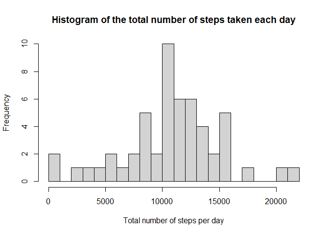
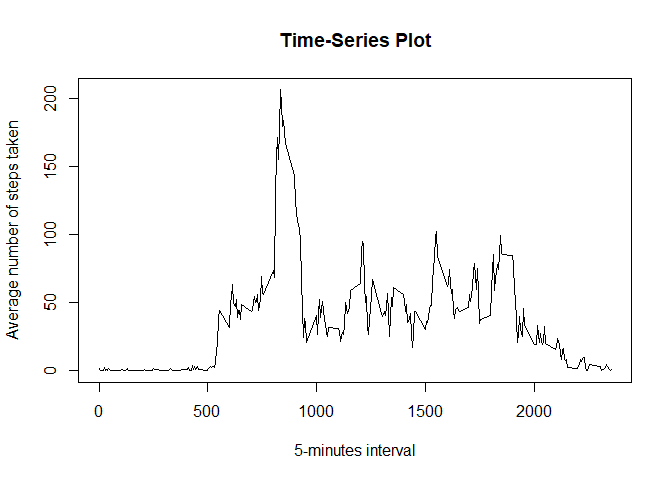
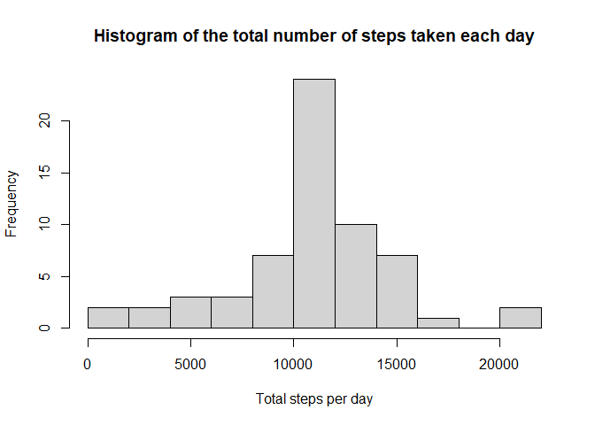
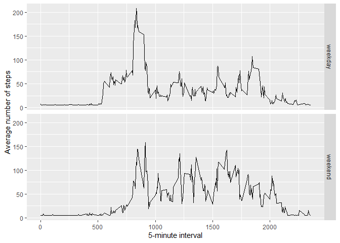

## Loading and preprocessing the data

##### 1. Load the data 

```r
library(lubridate)
library(dplyr)
library(Hmisc)
```


```r
dataset <- read.csv("M:/Harshad R/R/R Cousera Courses/R Course_5 Reproducible Research/Week_2/Peer Graded Assignment/repdata_data_activity/activity.csv", sep = ",")
```

##### 2. Preprocessing the data

```r
dataset$date <- ymd(dataset$date)
dataset <- na.omit(dataset)
```
## What is mean total number of steps taken per day?

##### 1. Total number of steps taken per day

```r
totalsteps <- dataset %>% group_by(date) %>% summarise(sum= sum(steps))
```

##### 2. Histogram of the total number of steps taken each day

```r
hist(totalsteps$sum, breaks = 20, xlab = "Total number of steps per day", main = "Histogram of the total number of steps taken each day")
```

<!-- -->

##### 3. Mean and median total number of steps taken per day

```r
mean(totalsteps$sum)
```

```
## [1] 10766.19
```

```r
median(totalsteps$sum)
```

```
## [1] 10765
```


## What is the average daily activity pattern?

##### 1. Calculating the mean steps 

```r
meansteps <- dataset %>% group_by( interval) %>% summarise(mean= mean(steps))
```
##### 2. Plotting time-series plot

```r
with(meansteps, plot(interval, mean, type="l",xlab="5-minutes interval",
    ylab="Average number of steps taken", main="Time-Series Plot" ))
```

<!-- -->

##### 3.  The 5-minute interval on average across all the days in the dataset that contains the maximum number of steps

```r
 meansteps[which(meansteps$mean== max(meansteps$mean)),]
```

```
## # A tibble: 1 x 2
##   interval  mean
##      <int> <dbl>
## 1      835  206.
```

## Imputing missing values

##### 1. Loading the main dataset again

```r
dataset <- read.csv("M:/Harshad R/R/R Cousera Courses/R Course_5 Reproducible Research/Week_2/Peer Graded Assignment/repdata_data_activity/activity.csv", sep = ",")
```

##### 2. Calculating the total number of missing values

```r
missingValues <- sum(is.na(dataset))
```
Number of missing values : 2304

##### 3. Imputing data

```r
datasetNoNA <- dataset
datasetNoNA$steps <-impute(dataset$steps, fun = mean )
```

##### 4. Total number of steps taken each day

```r
totalstepsNoNA <- datasetNoNA %>% group_by(date) %>% summarise(sum= sum(steps))
```

##### 5. Histogram of the total number of steps taken each day

```r
hist(totalstepsNoNA$sum, breaks = 10, xlab = "Total steps per day", main = "Histogram of the total number of steps taken each day")
```

<!-- -->

##### 6. Calculating mean and median total number of steps taken each day

```r
mean(totalstepsNoNA$sum)
```

```
## [1] 10766.19
```

```r
median(totalstepsNoNA$sum)
```

```
## [1] 10766.19
```

####### As we can see, new figures are almost the same as before imputing NA values. The median has changed a bit and became equal to the mean.

## Are there differences in activity patterns between weekdays and weekends?


```r
datasetNoNA$day<-strptime(dataset[,2], "%Y-%m-%d")
datasetNoNA$weekdays<-weekdays(datasetNoNA$day)

weekdays <- filter(datasetNoNA, grepl("Monday|Tuesday|Wednesday|Thursday|Friday", weekdays))
weekends <- filter(datasetNoNA, grepl("Saturday|Sunday", weekdays))

merge <- rbind(weekdays,weekends)
merge <- select(merge, c("steps", "date", "interval", "weekdays"))
merge$weekdays <- as.list(merge$weekdays)

merge$weekdays<- gsub("Monday", "weekday", merge$weekdays)
merge$weekdays<- gsub("Tuesday", "weekday", merge$weekdays)
merge$weekdays<- gsub("Wednesday", "weekday", merge$weekdays)
merge$weekdays<- gsub("Thursday",  "weekday", merge$weekdays)
merge$weekdays<- gsub("Friday", "weekday", merge$weekdays)
merge$weekdays<- gsub("Saturday", "weekend", merge$weekdays)
merge$weekdays<- gsub("Sunday", "weekend", merge$weekdays)

merge$weekdays <- as.factor(merge$weekdays)

averagesteps <- merge %>% group_by(interval, weekdays) %>% summarise(averagesteps = mean(steps))
```

##### Plotting time-series plot 

```r
g <- ggplot(averagesteps, aes(interval, averagesteps))
g+geom_line() + facet_grid(weekdays~.) + 
  xlab("5-minute interval") + 
    ylab("Average number of steps")
```

<!-- -->


